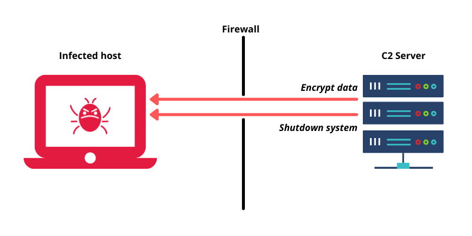

---

title: "Command-and-Control (C2) — Guia Técnico Completo"
author: "Marllon"
date: 2026-01-15
license: MIT
------------



# Command-and-Control (C2) — Guia Técnico Completo

> Documento técnico em Markdown, voltado para publicação profissional em cibersegurança.

---

## 📌 Sumário

* [Introdução](#introdução)
* [Definição formal de C2](#definição-formal-de-c2)
* [Objetivos e funções de um sistema C2](#objetivos-e-funções-de-um-sistema-c2)
* [Arquitetura de um sistema C2](#arquitetura-de-um-sistema-c2)
* [Ciclo operacional de um C2](#ciclo-operacional-de-um-c2)
* [Tipos de C2 por canal de comunicação](#tipos-de-c2-por-canal-de-comunicação)
* [Arquiteturas de controle](#arquiteturas-de-controle)
* [Técnicas operacionais avançadas](#técnicas-operacionais-avançadas)
* [Beaconing, jitter e controle de tempo](#beaconing-jitter-e-controle-de-tempo)
* [Evasão e camuflagem de tráfego](#evasão-e-camuflagem-de-tráfego)
* [Persistência e resiliência](#persistência-e-resiliência)
* [Exemplos de frameworks e plataformas C2](#exemplos-de-frameworks-e-plataformas-c2)
* [Indicadores de comprometimento (IOCs)](#indicadores-de-comprometimento-iocs)
* [Detecção e hunting](#detecção-e-hunting)
* [Mitigação e hardening](#mitigação-e-hardening)
* [Resposta a incidentes envolvendo C2](#resposta-a-incidentes-envolvendo-c2)
* [Conclusão](#conclusão)

---

## Introdução

Em operações ofensivas modernas, o componente mais crítico de qualquer malware avançado ou operação de intrusão persistente é a infraestrutura de **Command-and-Control (C2)**. O C2 é responsável por permitir que o operador remoto mantenha controle contínuo sobre sistemas comprometidos, execute comandos, receba dados e atualize implantes de forma furtiva.

Do ponto de vista defensivo, compreender profundamente como sistemas C2 funcionam — desde protocolos e padrões de tráfego até técnicas de evasão — é essencial para detectar, interromper e erradicar ameaças persistentes.

Este documento apresenta uma visão técnica detalhada, com foco em análise de arquitetura, protocolos, detecção e resposta a incidentes.

---

## Definição formal de C2

**Command-and-Control (C2)** é um conjunto de mecanismos, protocolos e infraestrutura utilizados por um operador para:

* Enviar instruções a um agente (implant/backdoor) presente em um sistema comprometido.
* Receber dados exfiltrados.
* Orquestrar operações distribuídas.
* Atualizar ou substituir módulos implantados.

Formalmente, pode ser modelado como um sistema distribuído assíncrono:

```
Operador → Infraestrutura C2 → Agente (endpoint comprometido)
Agente → Infraestrutura C2 → Operador
```

A infraestrutura C2 atua como intermediário lógico e físico entre os dois polos, abstraindo controle, roteamento, autenticação e persistência.

---

## Objetivos e funções de um sistema C2

Um sistema C2 bem projetado oferece:

* **Execução remota de comandos (RCE)** em tempo real ou diferido.
* **Entrega modular de payloads secundários** (keylogging, lateral movement, tunneling, proxying).
* **Exfiltração de dados estruturada** e resiliente.
* **Persistência de acesso** após reboot ou atualização.
* **Coordenação distribuída** entre múltiplos agentes.
* **Resiliência operacional** contra bloqueios, sinkholes e quedas de infraestrutura.

---

## Arquitetura de um sistema C2

### Componentes principais

1. **Agente / Beacon / Implant**

   * Executado no host comprometido.
   * Responsável por comunicação, execução de tarefas e coleta de dados.

2. **Servidor(es) C2**

   * Hospedam os endpoints de controle.
   * Podem ser dedicados, temporários, proxyados ou hospedados em serviços legítimos.

3. **Console / Painel de controle**

   * Interface usada para gerenciar sessões, tarefas e operações.

4. **Infraestrutura auxiliar**

   * CDNs, domínios, certificados TLS, proxies reversos, load balancers.

### Diagrama lógico

```
[Operador]
     ↓
[Console C2]
     ↓
[Servidor(s) C2] ←→ [Infraestrutura intermediária]
     ↓
[Agente / Beacon]
```

---

## Ciclo operacional de um C2

1. **Comprometimento inicial:** phishing, exploração, abuso de credenciais, supply chain.
2. **Implantação do agente:** dropper ou loader injeta o beacon.
3. **Registro inicial (check-in):** handshake inicial com o C2.
4. **Beaconing contínuo:** comunicação periódica.
5. **Execução de tarefas:** comandos, módulos, coleta de dados.
6. **Exfiltração:** transferência estruturada.
7. **Manutenção:** atualização de implantes e rotação de infraestrutura.
8. **Desativação ou limpeza:** opcional.

---

## Tipos de C2 por canal de comunicação

### HTTP / HTTPS

* Mais comum.
* Utiliza GET/POST, cookies, headers, URIs camufladas.
* Pode usar TLS com certificados legítimos ou customizados.

### DNS

* Comunicação via consultas DNS.
* Dados embutidos em subdomínios ou respostas TXT.
* Difícil de bloquear sem impacto operacional.

### ICMP

* Encapsula dados em pacotes ICMP.
* Menos comum, mas eficaz em ambientes permissivos.

### SMTP / IMAP / POP3

* Comunicação via e-mail.
* Pode usar caixas postais como intermediários.

### WebSockets / gRPC / QUIC

* Protocolos modernos que se misturam ao tráfego web legítimo.

### Abuse de serviços legítimos (LOTL)

* GitHub, Google Docs, Dropbox, OneDrive, Pastebin, Discord, Slack.
* Dificulta bloqueio baseado em domínio.

---

## Arquiteturas de controle

### Centralizada

* Um ou poucos servidores controlam todos os agentes.
* Simples, porém vulnerável a derrubadas.

### Hierárquica

* Servidores intermediários (tiered C2).
* Reduz exposição do núcleo.

### Peer-to-Peer (P2P)

* Cada agente atua como nó.
* Comandos propagam-se pela rede.
* Alta resiliência.

### Mesh / Overlay

* Combinação de P2P com nós de controle dedicados.

---

## Técnicas operacionais avançadas

### Encapsulamento e criptografia

* Criptografia simétrica/assimétrica em camada de aplicação.
* Mensagens estruturadas e ofuscadas.
* Separação entre canal de transporte e canal lógico.

### Modularidade

* Implantes carregam módulos sob demanda.
* Reduz superfície inicial e aumenta furtividade.

### Staging

* Entrega em múltiplas fases (stage 0 → stage 1 → stage 2).
* Cada estágio baixa o próximo.

---

## Beaconing, jitter e controle de tempo

### Beaconing

* O agente realiza *check-ins* periódicos.
* Intervalos podem ser fixos ou dinâmicos.

### Jitter

* Introduz aleatoriedade nos intervalos.
* Reduz detectabilidade baseada em periodicidade.

### Backoff adaptativo

* Frequência ajustada conforme falhas ou sucesso.
* Minimiza ruído em redes monitoradas.

### Sleep obfuscation

* O agente entra em estado inerte ou criptografado em memória entre ciclos.

---

## Evasão e camuflagem de tráfego

* **User-Agent spoofing:** imitação de navegadores reais.
* **Header blending:** uso de cabeçalhos comuns (Accept, Referer, Cookies).
* **Domain fronting:** uso de CDNs para ocultar destino real.
* **Fast flux:** rotação rápida de IPs.
* **DGA (Domain Generation Algorithm):** geração programática de domínios.
* **Traffic shaping:** volumes baixos e frequências espaçadas.

---

## Persistência e resiliência

### Persistência

* Registro de inicialização.
* Serviços.
* Scheduled tasks.
* DLL hijacking.
* WMI event subscriptions.

### Resiliência

* Múltiplos domínios/hosts.
* Fallbacks automáticos.
* Infraestrutura rotativa.

---

## Exemplos de frameworks e plataformas C2

*(Para fins de estudo técnico, engenharia reversa e desenvolvimento de detecção.)*

* **Cobalt Strike**
* **Sliver**
* **Metasploit**
* **Empire / Starkiller**
* **Mythic**
* **Covenant**
* **PoshC2**

Essas plataformas implementam múltiplos canais, criptografia de aplicação, jitter, modularidade e interfaces de controle avançadas.

---

## Indicadores de comprometimento (IOCs)

### Rede

* Tráfego periódico para domínios externos incomuns.
* Consultas DNS com alto grau de entropia.
* Conexões TLS com certificados autoassinados ou suspeitos.
* Fluxos pequenos e constantes.

### Host

* Processos filhos inesperados.
* Injeção de código em processos legítimos.
* Execução em memória sem arquivo no disco.
* Artefatos de persistência.

### Logs

* Criação de tarefas agendadas.
* Alterações de chaves de inicialização.
* Execução fora de diretórios padrão.

---

## Detecção e hunting

### Detecção baseada em rede

* Análise de periodicidade (autocorrelação, clustering temporal).
* Detecção de anomalias em DNS.
* Inspeção de TLS (quando aplicável).

### Detecção baseada em host

* Monitoramento comportamental (EDR/XDR).
* Detecção de injeção, hollowing, reflective loading.

### Hunting proativo

* Queries em SIEM para padrões de beaconing.
* Correlação entre criação de processos e conexões externas.
* Busca por domínios recém-registrados acessados internamente.

---

## Mitigação e hardening

* **Egress filtering:** permitir apenas destinos/protocolos necessários.
* **Segmentação de rede:** limitar movimento lateral.
* **Least privilege:** reduzir impacto de comprometimento.
* **Controle de execução:** AppLocker, WDAC, políticas de restrição.
* **Atualizações contínuas:** patching de sistemas e aplicações.
* **Gestão de certificados e TLS:** visibilidade de tráfego criptografado.

---

## Resposta a incidentes envolvendo C2

### 1. Identificação

* Confirmar comunicação C2.
* Preservar evidências.

### 2. Contenção

* Bloquear canais de saída.
* Isolar hosts comprometidos.

### 3. Erradicação

* Remover implantes.
* Revogar credenciais.
* Corrigir vetores iniciais.

### 4. Recuperação

* Restaurar sistemas limpos.
* Reintroduzir hosts na rede.

### 5. Lições aprendidas

* Atualizar regras de detecção.
* Melhorar controles preventivos.

---

## Conclusão

Sistemas C2 representam o núcleo operacional de ameaças persistentes modernas. A defesa eficaz exige compreensão profunda de seus padrões comportamentais, arquiteturas e técnicas de evasão. Ao investir em detecção comportamental, correlação de eventos e resposta coordenada, equipes de segurança podem reduzir significativamente o impacto dessas ameaças.

Este documento fornece uma base técnica sólida para profissionais que desejam demonstrar domínio avançado sobre C2 em portfólios, pesquisas e ambientes corporativos.

